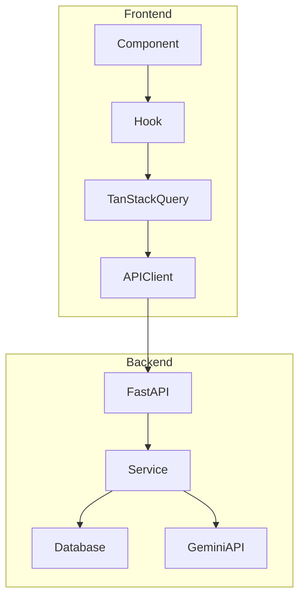

# Bondify Architecture

## Overview

Bondify is a vocabulary learning application built with a React + TypeScript frontend and Python FastAPI backend.

## Tech Stack

### Frontend
- **Framework**: React 18 + TypeScript + Vite
- **State Management**: TanStack Query (React Query v5)
- **Routing**: React Router v6
- **UI**: Radix UI + Tailwind CSS + Framer Motion
- **Forms**: React Hook Form + Zod

### Backend
- **Framework**: FastAPI (Python)
- **Database**: SQLAlchemy + SQLite/PostgreSQL
- **AI**: Google Gemini API for question generation

## Directory Structure

```
src/
├── components/       # Shared UI components
│   ├── layout/       # MainLayout, Header, Sidebar
│   └── ui/           # Shadcn UI components
├── contexts/         # React contexts (StatsContext)
├── hooks/            # Custom hooks
│   ├── useGameQuestions.ts   # Game question fetching
│   ├── useWordlist.ts        # Wordlist CRUD
│   └── useGameProgress.ts    # Progress tracking
├── lib/
│   ├── api/          # API client functions
│   └── api.ts        # Base API client with auth
├── pages/            # Route pages
└── admin/            # Admin interface
```

## Data Flow



## Key Patterns

### 1. TanStack Query for Data Fetching
All data fetching uses TanStack Query hooks for caching, auto-refetching, and state management. See [tanstack-query.md](./tanstack-query.md).

### 2. Context for Global State
`StatsContext` provides user profile and learning stats globally, backed by TanStack Query.

### 3. Game Progress Tracking
`useGameProgress` hook standardizes progress recording across all games.

### 4. AI Question Generation
Backend uses Gemini API to generate game questions with duplicate checking and difficulty levels.
