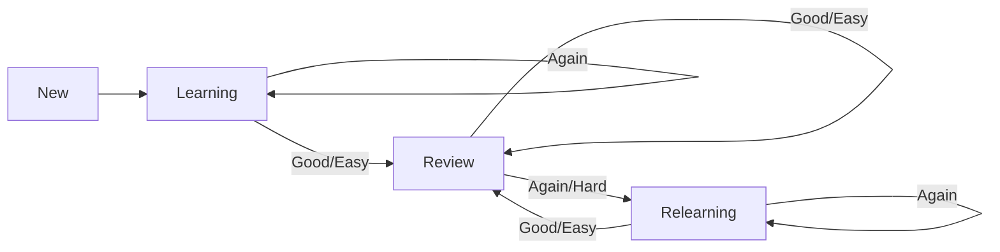

# Spaced Repetition System (SRS) Documentation

## Overview

Bondify uses **FSRS (Free Spaced Repetition Scheduler)** algorithm to optimize vocabulary retention through scientifically-proven spaced repetition. FSRS is a modern algorithm that outperforms traditional SM-2 (used by Anki) in optimizing memory retention.

---

## How SRS Works

### Rating System

When reviewing a word, users rate their recall ability:

| Rating | Label | Meaning | Effect |
|--------|-------|---------|--------|
| 1 | Again | Didn't remember at all | Reset interval to short |
| 2 | Hard | Remembered with difficulty | Small interval increase |
| 3 | Good | Remembered after hesitation | Normal interval increase |
| 4 | Easy | Remembered instantly | Large interval increase |

### Card States

Cards progress through different states based on review performance:

| State | Description |
|-------|-------------|
| **New** | Word just added, not yet reviewed |
| **Learning** | Initial learning phase (short intervals: minutes to hours) |
| **Review** | Long-term review phase (intervals: days to months) |
| **Relearning** | Forgot word, back to short intervals |

### State Transitions



---

## Architecture

### Data Model

The `UserWordlist` model stores FSRS-specific fields:

| Field | Type | Description |
|-------|------|-------------|
| `fsrs_card_json` | Text | Serialized FSRS Card object (stability, difficulty, etc.) |
| `fsrs_due` | DateTime | Next scheduled review time |
| `fsrs_state` | String | Current state: New, Learning, Review, Relearning |
| `review_count` | Integer | Total number of reviews |
| `mastery_level` | Integer | Mastery score 0-100 |

### Backend Service

**File:** `backend/app/services/srs_service.py`

The `SpacedRepetitionService` class manages all SRS operations:

```python
class SpacedRepetitionService:
    def __init__(self, db: AsyncSession):
        self.scheduler = Scheduler(
            desired_retention=0.9,  # 90% target retention
            maximum_interval=365,   # Max 1 year between reviews
        )
    
    # Key methods:
    async def get_due_words(user_id, limit)     # Fetch cards due for review
    async def record_review(user_id, word_id, rating)  # Record review result
    async def get_srs_stats(user_id)            # Get statistics
    async def get_review_forecast(user_id, days) # Forecast future reviews
```

### Mastery Calculation

Mastery level (0-100) is calculated based on card state and retrievability:

```python
def _calculate_mastery(self, card: Card) -> int:
    retrievability = self.scheduler.get_card_retrievability(card)
    
    state_bonus = {
        "New": 0,
        "Learning": 10,
        "Review": 50,
        "Relearning": 20,
    }
    base = state_bonus.get(card.state.name, 0)
    retrieval_bonus = int(retrievability * 50)
    
    return min(100, base + retrieval_bonus)
```

---

## Integration Points

### 1. Word List → SRS

When a word is added to the user's Word List, it automatically becomes an SRS card:

```
Add Word to Wordlist → FSRS Card Created (New state) → Due for Review
```

### 2. Game → SRS Integration

Incorrect answers in vocabulary games automatically add words to SRS:

**Files:** 
- `src/hooks/useGameSRS.ts` - Hook for game-SRS integration
- `src/pages/RecallGame.tsx` - Uses `useGameSRS`
- `src/pages/RocketGame.tsx` - Uses `useGameSRS`

```typescript
// In game components:
const { recordMissedWord } = useGameSRS();

// When user answers incorrectly:
recordMissedWord(word, definition);
// → Word added to wordlist → SRS card created
```

### 3. SRS Review Page

**File:** `src/pages/SRSReview.tsx`

User flow:
1. Load due words via `useDueWords(50)`
2. Display word card (front: word only)
3. User clicks "Show Answer"
4. Display definition and examples
5. User selects rating (Again/Hard/Good/Easy)
6. Card advances to next, repeat until complete

---

## API Reference

| Endpoint | Method | Description |
|----------|--------|-------------|
| `/api/srs/due` | GET | Get words due for review |
| `/api/srs/review` | POST | Record a review (rating 1-4) |
| `/api/srs/stats` | GET | Get SRS statistics |
| `/api/srs/forecast` | GET | Review forecast (next N days) |

### Request/Response Examples

#### Get Due Words
```http
GET /api/srs/due?limit=20
Authorization: Bearer <token>
```

Response:
```json
{
  "words": [
    {
      "id": 1,
      "word": "ephemeral",
      "definition": "lasting for a very short time",
      "partOfSpeech": "adjective",
      "pronunciation": "/ɪˈfem(ə)rəl/",
      "examples": ["Fame is ephemeral."],
      "state": "New",
      "due": null
    }
  ],
  "total": 1
}
```

#### Record Review
```http
POST /api/srs/review
Authorization: Bearer <token>
Content-Type: application/json

{
  "word_id": 1,
  "rating": 3
}
```

Response:
```json
{
  "id": 1,
  "word": "ephemeral",
  "state": "Learning",
  "due": "2026-02-04T13:30:00Z",
  "masteryLevel": 15,
  "reviewCount": 1
}
```

#### Get Statistics
```http
GET /api/srs/stats
Authorization: Bearer <token>
```

Response:
```json
{
  "totalCards": 50,
  "dueToday": 12,
  "newCards": 5,
  "learningCards": 3,
  "reviewCards": 40,
  "relearningCards": 2,
  "averageRetention": 0.85
}
```

---

## Frontend Hooks

**File:** `src/hooks/useSRS.ts`

| Hook | Purpose |
|------|---------|
| `useDueWords(limit)` | Fetch words due for review |
| `useRecordReview()` | Mutation to record review result |
| `useSRSStats()` | Fetch SRS statistics |
| `useReviewForecast(days)` | Fetch review forecast |

```typescript
// Example usage:
const { data: dueData, isLoading } = useDueWords(50);
const { data: stats } = useSRSStats();
const recordReviewMutation = useRecordReview();

// Record a review:
await recordReviewMutation.mutateAsync({
  wordId: currentWord.id,
  rating: 3, // Good
});
```

---

## FSRS Algorithm Details

### Key Parameters

| Parameter | Value | Description |
|-----------|-------|-------------|
| `desired_retention` | 0.9 | Target 90% retention rate |
| `maximum_interval` | 365 | Maximum 1 year between reviews |

### How Intervals Are Calculated

FSRS uses a neural network-based model to predict optimal review intervals. Key factors:

1. **Stability**: How well the memory is consolidated
2. **Difficulty**: Inherent difficulty of the card
3. **Retrievability**: Probability of successful recall

The algorithm adapts to each user's memory patterns over time, providing personalized scheduling.

---

## Implementation Status

| Feature | Status |
|---------|--------|
| Manual SRS Review | ✅ Complete |
| Word List → SRS | ✅ Complete |
| Game → Word List (auto) | ✅ Complete |
| Statistics Dashboard | ✅ Complete |
| Review Forecast | ✅ Complete |
| SRS-Powered Games | ⏳ Planned |

---

## Future Enhancements

1. **SRS-Powered Game Mode**: Games pull questions from SRS due words
   - Correct answer = Good rating
   - Incorrect = Again rating
   
2. **Custom FSRS Parameters**: Allow users to tune retention targets

3. **Review Heatmap**: Visual calendar showing review activity

4. **Study Streaks**: Gamification with daily review streaks
