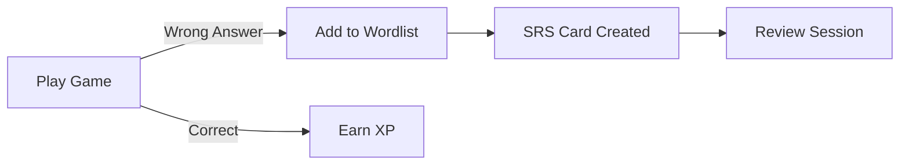

# Spaced Repetition System (SRS) Documentation

## Overview

Bondify uses **FSRS (Free Spaced Repetition Scheduler)** algorithm to optimize vocabulary retention through scientifically-proven spaced repetition.

## How SRS Works

### Rating System
| Rating | Label | Meaning | Effect |
|--------|-------|---------|--------|
| 1 | Again | Didn't remember | Reset interval to 1 day |
| 2 | Hard | Remembered with difficulty | Short interval increase |
| 3 | Good | Remembered after hesitation | Normal interval increase |
| 4 | Easy | Remembered instantly | Large interval increase |

### Card States
- **New**: Word just added, not yet reviewed
- **Learning**: Initial learning phase (short intervals)
- **Review**: Long-term review phase
- **Relearning**: Forgot word, back to short intervals

---

## Current Integration

### Word List → SRS
Words added to your Word List automatically become SRS cards.

```
Add Word to Wordlist → SRS Card Created → Due for Review
```

### SRS Review Page (`/srs-review`)
- Access from sidebar "SRS Review"
- Shows all due cards for today
- Rate each card to schedule next review

---

## Future: Game Integration

> [!NOTE]
> The following describes planned integration between games and SRS.

### Planned Flow



### Integration Points

1. **Vocabulary Games** (Rocket, Recall, Context Match)
   - Incorrect answers → Word added to Word List automatically
   - Word becomes SRS card with initial "Again" rating

2. **After Game Summary**
   - Show which words were added to SRS
   - Option to start SRS review immediately

3. **SRS-Powered Game Mode** (Future)
   - Games pull questions from SRS due words
   - Correct answer = Good rating
   - Incorrect = Again rating
   - Combines game fun with SRS efficiency

### Implementation Status

| Feature | Status |
|---------|--------|
| Manual SRS Review | ✅ Complete |
| Word List → SRS | ✅ Complete |
| Game → Word List (auto) | ✅ Complete |
| SRS-Powered Games | ⏳ Planned |

---

## API Reference

| Endpoint | Method | Description |
|----------|--------|-------------|
| `/api/srs/due` | GET | Get due words |
| `/api/srs/review` | POST | Record review (rating 1-4) |
| `/api/srs/stats` | GET | Get SRS statistics |
| `/api/srs/forecast` | GET | Review forecast (next N days) |
